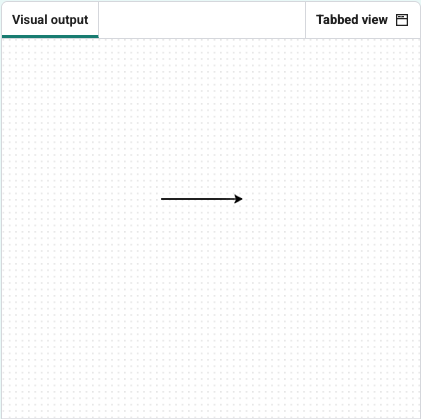

<h2 class="c-project-heading--task">Draw a line</h2>

The number in the line `turtle.forward(200)` is the length.

### Step 1

Click **Run** to see the length of a 200 line.

Change the number in the line `turtle.forward(200)`

--- code ---
---
language: python
filename: main.py
line_numbers: true
line_number_start: 1
line_highlights: 5
---
from turtle import Turtle

turtle = Turtle()

turtle.forward(100)
--- /code ---

### Step 2

Click **Run** to see your new changes.

