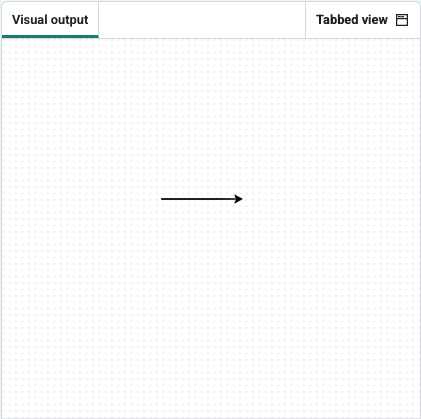

## Draw a line

Change the number in the line `turtle.forward(200)`.

```python filename="main.py" line_numbers="true" line_highlights="5"
from turtle import Turtle

turtle = Turtle()

turtle.forward(200)
```

## Now run your code

Click **Run** and check that the turtle draws a straight line to the right.


