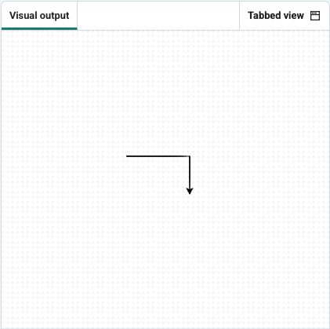

<h2 class="c-project-heading--task">Turning</h2>

Make the turtle turn around.

### Step 1

To turn the turtle, it has to move forward and turn right (or left). 

--- code ---
---
language: python
filename: main.py
line_numbers: true
line_number_start: 1
line_highlights: 6-7
---
from turtle import Turtle

turtle = Turtle()

turtle.forward(100)
turtle.right(90)
turtle.forward(60)
--- /code ---

### Step 2

Click **Run** to see your new changes.

### Tip

- `turtle.right(90)` turns the cursor 90 degrees right. 
- `turtle.left(90)` turns the cursor 90 degrees left.

