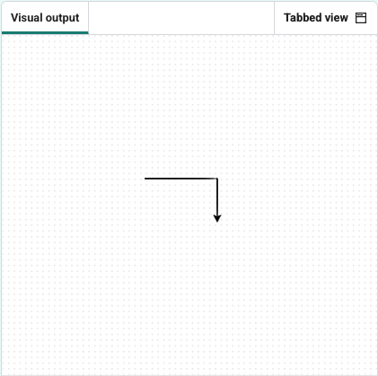

## Turning

Make the turtle turn around.

To turn the turtle, it has to move forward and turn right (or left).

```python filename="main.py" line_numbers="true" line_highlights="6-7"
from turtle import Turtle

turtle = Turtle()

turtle.forward(100)
turtle.right(90)
turtle.forward(60)
```

> [!TIP]
>
> - `turtle.right(90)` turns the cursor 90 degrees right.
> - `turtle.left(90)` turns the cursor 90 degrees left.

## Now run your code

Click **Run** and check that the line turns and then carries on drawing in the new direction.


