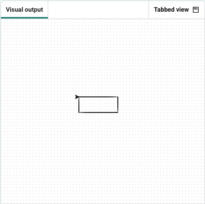

<h2 class="c-project-heading--task">Draw a rectangle</h2>

## Step 1

All angles are right angles (90 degrees).

Add a loop that repeats the path twice to complete the rectangle.

--- code ---
---
language: python
filename: main.py
line_numbers: true
line_number_start: 1
line_highlights: 5-9
---
from turtle import Turtle

turtle = Turtle()

for i in range(2):
    turtle.forward(100)
    turtle.right(90)
    turtle.forward(60)
    turtle.right(90)

--- /code ---

## Step 2

### Experiment
Try to draw all of these shapes, to become a true shape master:

- A square (all sides the same length)
- A triangle (how many degrees do you need to turn?)
- A cross (`backward` and `forward` work well together)
- A circle (what happens if you turn a small amount lots of times, and move forward a tiny bit each time?)

## Now run your code

Click **Run** and check that the turtle draws your shape correctly.
