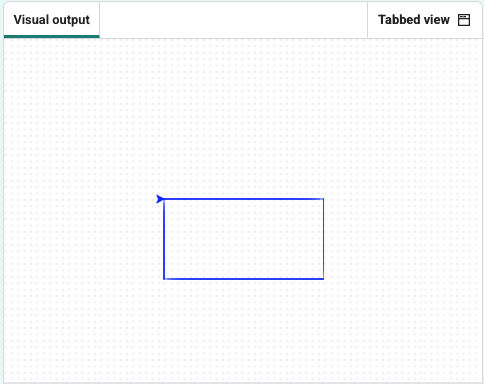

<h2 class="c-project-heading--task">Speedy colour!</h2>

Give your shape a bright blue pen colour and speed the turtle up!

<h2 class="c-project-heading--explainer">Follow these instructions</h2>

## Step 1

Add R, G and B values, then change the `color` attribute.

Set the speed attribute to `0`, which removes any animation delay.

--- code ---
---
language: python
filename: main.py
line_numbers: true
line_number_start: 1
line_highlights: 5-8, 10
---
from turtle import Turtle

turtle = Turtle()

R = 0
G = 0
B = 255
turtle.color((R/255, G/255, B/255))

turtle.speed(0)

for i in range(2):
    turtle.forward(100)
    turtle.right(90)
    turtle.forward(60)
    turtle.right(90)
--- /code ---

### Tip

- **RGB values** are used to pick colours. 
- RGB stands for **Red**, **Green**, and **Blue**
- Each can be set from `0` (none) to `255` (full). 
- In the next few steps, a rectangle is used in the example code so you can see how each new concept works.  
- If you made a different shape in earlier steps, that’s fine — just apply the same ideas to your own shape! 

## Step 2

### Experiment

- Change the pen colour to your favourite colour.

## Now run your code

Click **Run** and check that the turtle draws your shape in the pen colour you chose.
