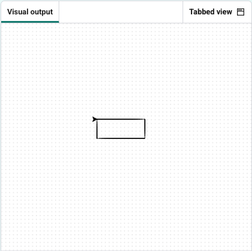

<h2 class="c-project-heading--task">Draw a rectangle</h2>
--- task ---

A rectangle has **two** long sides of equal length (100) and **two** short sides of equal length (60).

All angles are right angles (90 degrees).
--- /task ---

Add a loop that repeats the path twice to complete the rectangle.

--- code ---
---
language: python
filename: main.py
line_numbers: true
line_number_start: 1
line_highlights: 5-9
---
from turtle import Turtle

turtle = Turtle()

for i in range(2):
    turtle.forward(100)
    turtle.right(90)
    turtle.forward(60)
    turtle.right(90)

--- /code ---

--- task ---
### Experiment
Try to draw all of these shapes, to become a true shape master:

- Draw a square.
- Draw a triangle (how many degrees do you need to turn?)
- Draw a cross (`backward` and `forward` work well together)
- Draw a circle (what happens if you turn a small amount lots of times, and move forward a tiny bit each time?) 

--- /task ---