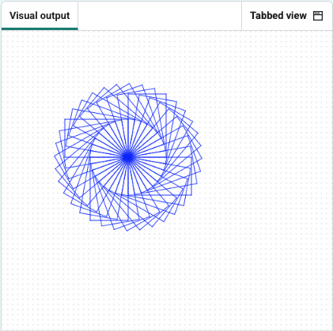

<h2 class="c-project-heading--task">Draw a spiral of shapes</h2>

Use loops to create a repeated pattern.

<h2 class="c-project-heading--explainer">Follow these instructions</h2>

## Step 1

Then, add an outer loop and a small turn after each rectangle.

--- code ---
---
language: python
filename: main.py
line_numbers: true
line_number_start: 1
line_highlights: 12-18
---
from turtle import Turtle

turtle = Turtle()

R = 0
G = 0
B = 255
turtle.color((R/255, G/255, B/255))

turtle.speed(0)

for j in range(36):
    for i in range(2):
        turtle.forward(100)
        turtle.right(90)
        turtle.forward(60)
        turtle.right(90)
    turtle.right(10)
--- /code ---

## Step 2

Run your code — now you have 36 blue rectangles rotated 10° to make a spiral.

### Tip

- The outer loop will draw the rectangle many times, turning a little after each one.
- Rotating 10° each loop: 360 ÷ 10 = 36 steps

## Now run your code

Confirm the observable result.
