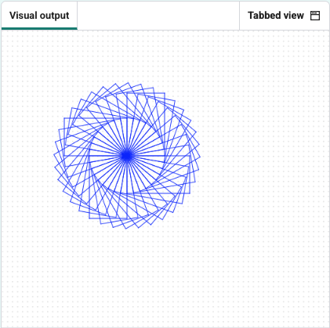

## Draw a spiral of shapes

Use loops to create a repeated pattern.

Add an outer loop and a small turn after each rectangle.

```python filename="main.py" line_numbers="true" line_highlights="12-18"
from turtle import Turtle

turtle = Turtle()

R = 0
G = 0
B = 255
turtle.color((R/255, G/255, B/255))

turtle.speed(0)

for j in range(36):
    for i in range(2):
        turtle.forward(100)
        turtle.right(90)
        turtle.forward(60)
        turtle.right(90)
    turtle.right(10)
```

> [!TIP]
>
> - The outer loop will draw your shape many times, turning a little after each one
> - Rotating 10° each loop: 360 ÷ 10 = 36 steps

## Now run your code

Run your code and check that your 36 shapes make a spiral.


