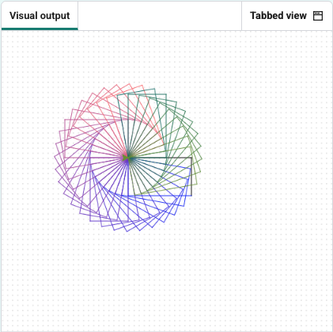

<h2 class="c-project-heading--task">Multi-colour spiral</h2>

Draw the spiral again with each rectangle in a **different colour**.

## Step 1

Move the `turtle.color` function inside the inner loop, so the spiral shifts colour each time your shape is drawn.

--- code ---
---
language: python
filename: main.py
line_numbers: true
line_number_start: 1
line_highlights: 8, 17-20
---
from turtle import Turtle

turtle = Turtle()

R = 0
G = 0
B = 255

turtle.speed(0)

for j in range(36):
    for i in range(2):
        turtle.forward(100)
        turtle.right(90)
        turtle.forward(60)
        turtle.right(90)
        R = (R + 5) % 256
        G = (G + 2) % 256
        B = (B - 3) % 256
        turtle.color((R/255, G/255, B/255))
    turtle.right(10)
--- /code ---

## Step 2

Run your code to see your changes.

## Step 3

### Experiment

- Try different numbers for `R`, `G`, and `B` to see new colour blends
- To change the colour slowly, use small numbers like `+1` or `-1`
- To make the colour shift faster, add or subtract larger numbers from `R`, `G`, or `B`
  

## Now run your code

Run your code and check that the spiral now changes through different colours.
