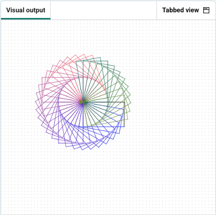

<h2 class="c-project-heading--task">Multi-colour spiral</h2>
--- task ---

Draw the spiral again with each rectangle in a **different colour**.  
--- /task ---

Change the `R`, `G`, and `B` values inside the inner loop so the spiral shifts colour as it draws.

Then set `turtle.color()` each time two sides are drawn

--- code ---
---
language: python
filename: main.py
line_numbers: true
line_number_start: 1
line_highlights: 8, 17-20
---
from turtle import Turtle

turtle = Turtle()

R = 0
G = 0
B = 255

turtle.speed(0)

for j in range(36):
    for i in range(2):
        turtle.forward(100)
        turtle.right(90)
        turtle.forward(60)
        turtle.right(90)
        R = (R + 5) % 256
        G = (G + 2) % 256
        B = (B - 3) % 256
        turtle.color((R/255, G/255, B/255))
    turtle.right(10)
--- /code ---

--- task ---

Run your code to see your changes.
--- /task ---

--- task ---
### Experiment

- Try different numbers for `R`, `G`, and `B` changes to see new colour blends.
- Make the colour shift faster: increase the numbers you add or subtract from `R`, `G`, or `B`.
- To slow the colour change, use smaller numbers like `+1` or `-1`.
--- /task ---

