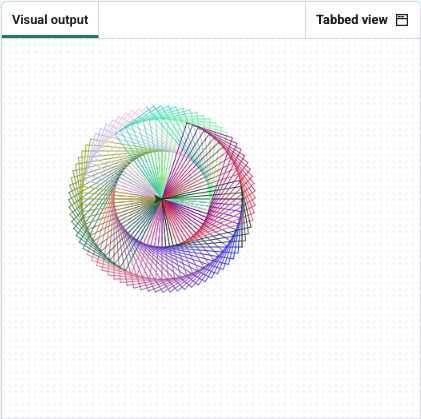

<h2 class="c-project-heading--task">Challenge: Tighter turns</h2>
--- task ---

 Change the **amount** the cursor turns, based on the number of shapes you want to make up the spiral.

--- /task ---

Add a new variable called `number_of_shapes`

Then use the variable as the number of shapes to draw and to calculate the angle to turn after each shape is drawn.

--- code ---
---
language: python
filename: main.py
line_numbers: true
line_number_start: 9
line_highlights: 11, 13, 23
---
turtle.speed(0)

number_of_shapes = 80

for j in range(number_of_shapes):
    for i in range(2):
        turtle.forward(100)
        turtle.right(90)
        turtle.forward(60)
        turtle.right(90)
        R = (R + 5) % 256
        G = (G + 2) % 256
        B = (B - 3) % 256
        turtle.color((R/255, G/255, B/255))
    turtle.right(360/number_of_shapes)
--- /code ---

--- task ---

### Experiment

Try changing the value of the new variable.

--- /task ---
