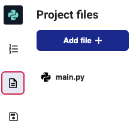

## Optional advanced experiments

The following activities are **optional extras**.  
They won’t change your main rectangle spiral script — instead, you’ll run them in a separate file.  
These examples are just for fun — explore and see what patterns you can make!

 

---

### Experiment 1: Better spirals
This experiment creates a very different spiral pattern by using a single long loop, adjusting the RGB values each time.

--- task ---
Click the **files menu** on the left of the screen, then choose **Add file** when the blue button appears.  
  
--- /task ---

--- task ---
Give your new file a sensible name, such as `better_spirals.py`.  
--- /task ---

--- task ---
Copy and paste the code below into your new file.  
--- /task ---

--- code ---
---
language: python
filename: better_spirals.py
line_numbers: true
line_number_start: 1
---
from turtle import Turtle, Screen

turtle = Turtle()
screen = Screen()

screen.bgcolor((255, 255, 255))
screen.colormode(255)

R = 255
G = 0
B = 0

for i in range(2000):
    G += 1
    B += 0.5
    R -= 1
    turtle.color((R, G, B))
    turtle.forward(i)
    turtle.right(98)
--- /code ---

--- task ---
Run the file to see the result.  
--- /task ---

Try changing the turn angle in `turtle.right(98)` and see how the spiral changes.

---

### Experiment 2: While‑loop rainbow spiral
This experiment uses **while loops** to generate a long list of colours and then loops through them to draw a complex spiral.

--- task ---
Click the **files menu** on the left of the screen, then choose **Add file** when the blue button appears.  
  
--- /task ---

--- task ---
Give your new file a sensible name, such as `whileloop_spiral.py`.  
--- /task ---

--- task ---
Copy and paste the code below into your new file:

--- code ---
---
language: python
filename: whileloop_spiral.py
line_numbers: true
line_number_start: 1
---
from turtle import Turtle, Screen

turtle = Turtle()
screen = Screen()
#screen.colormode(255)

R = 255
G = 0
B = 0

screen.bgcolor((0, 0, 255))

turtle.speed(0)

colours = []

while G <= 255:
    colours.append((R, G, B))
    G += 1

while R >= 0:
    colours.append((R, G, B))
    R -= 1

while B < 255:
    colours.append((R, G, B))
    B += 1

while G > 0:
    colours.append((R, G, B))
    G -= 1

while R < 255:
    colours.append((R, G, B))
    R += 1
  

for i in range(3000):
    turtle.color(colours[i % len(colours)])
    turtle.forward(i/3)
    turtle.right(119)
--- /code ---

--- /task ---

--- task ---
Run the file to see the result.  
--- /task ---

--- task ---
### Experiment
- [ ] Combine ideas from both experiments to create a unique pattern.  
- [ ] Change the turn angles, colours, or shapes to make something completely new.
--- /task ---
